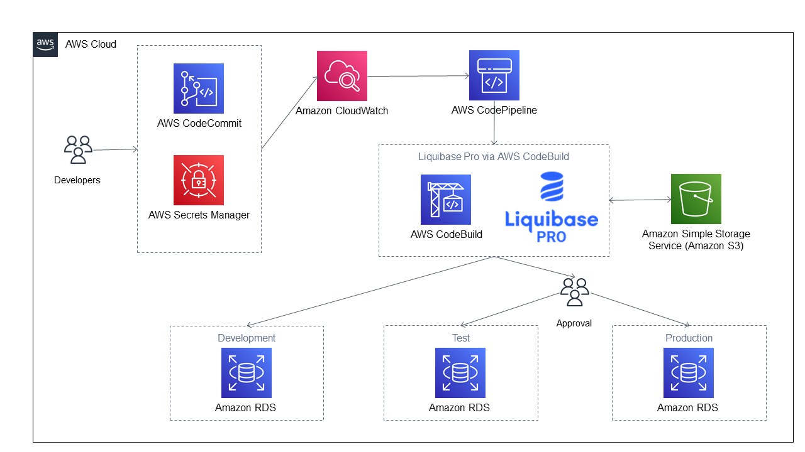

# Using Liquibase Pro with AWS CodePipeline and AWS CodeBuild via AWS CloudFormation

Databases are difficult to manage when releasing application code. Liquibase helps people align database code changes with application code changes. Below, you will find a CloudFormation file along with the a .zip file. By simply installing the .zip in an S3 bucket and executing CloudFormation with provided YAML file, you will have a simple, yet powerful, of how Liquibase Pro integrates with your existing AWS infrastructure.

All of the instances referenced in the diagram above are created by the CloudFormation script.

## 1. Setup Dependencies

### 1.1 Upload codebuild-cs-demo-project.zip to an S3 bucket

All artifacts required for this exercise are contained in the .zip file. The contents are sourced from this repository. Note that the name of the .zip file is hard coded in the CloudFormation YAML. If you rename the .zip file, make sure to rename in your CloudFormation YAML file.

Create a new S3 Bucket and upload codebuild-cs-demo-project.zip. You will need the URI for the new S3 Bucket.

### 2.2 Request a Liquibase Pro Trial License

If you do not have a Liquibase Pro License Key, request one [here](https://www.liquibase.org/try-liquibase-pro-free).

### 2.3 Identify a Database Subnet Group

Identify a Database Subnet Group in AWS RDS. You will need the Database Subnet Group. This will correspond to a VPC. You will need both of these values.

### 2.4 Choose a username and password for your databases

You will provide a username and password for each of your AWS RDS databases.

## 2. Create a stack using the provided CloudFormation template.

Using cloudformation-cs-demo-project.yml, navigate to CloudFormation in the AWS console.

Select CloudFormation -> Stacks -> Create Stack.
Select "Template is Ready".
Select "Upload a template file".
Select "Choose file" and select `cloudformation-cs-demo-project.yml`. 

Enter the `Stack Name`.
Enter the `ProjectName`. 
Enter the `Name of S3 Bucket housing Liquibase project files`. NOTE: strip off the `s3://` URI preample and trailing slash. Just the bucket name.
Enter the `LiqubiaseProKey`.
Select a VPC for your new stack.
Enter the corresponding Database Subnet Group Name for the VPC used previously.
Enter a Username and Password for each RDS database. The default username is `postgres`. 

